# TrueNAS backed PVCs on Talos Kubernetes using Democratic CSI

Credit: https://wazaari.dev/blog/truenas-talos-democratic-csi

I found the document to be highly insightful and valuable. That said, there are just a couple of very minor inaccuracies that might need attention.

## Talos, TrueNAS, Democratic CSI

This article will be an end to end guide on how to integrate Kubernetes (Talos specifically) with TrueNAS using [Democratic CSI](https://github.com/democratic-csi/democratic-csi).

Goals:

- API only connection (I do not like the idea of a CSI running ZFS commands on my NAS via SSH)
- NFS and iSCSI volumes
- Secure and minimalistic configuration on TrueNAS
- Snapshot support

Involved components:

- A Kubernetes cluster running Talos Linux (Talos version 1.13.3, Kubernetes version 1.36.1)
- A TrueNAS appliance (version 25.10.3.1 - Goldeye)

---

## Preparation

### Kubernetes / Talos

Visit https://factory.talos.dev/

Hardware Type: Cloud Server -> Choose Talos Linux Version -> Cloud: VMware -> Machine Architecture amd64 -> System Extensions: search and select vmtoolsd-guest-agent iscsi-tools nfs-utils -> Customization: BIOS only

Under Schematic Ready, copy the Schematic ID `80966aaec211a8562cd422cdfb2fb67644db9f135e5bf5f26017eefe71391b67`

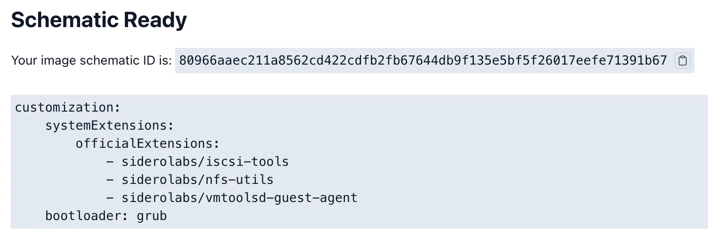

Check Node Extensions:

```
talosctl get extensions --nodes 10.1.1.23
NODE      NAMESPACE TYPE            ID VERSION NAME                  VERSION
10.1.1.23 runtime   ExtensionStatus 0  1       iscsi-tools           v0.2.0
10.1.1.23 runtime   ExtensionStatus 1  1       nfs-utils             v0.1.1
10.1.1.23 runtime   ExtensionStatus 2  1       vmtoolsd-guest-agent  v1.5.0
10.1.1.23 runtime   ExtensionStatus 3  1       schematic             80966aaec211a8562cd422cdfb2fb67644db9f135e5bf5f26017eefe71391b67

talosctl service ext-iscsid --nodes 10.1.1.22
NODE     10.1.1.22
ID       ext-iscsid
STATE    Running
HEALTH   ?
EVENTS   [Running]: Started task ext-iscsid (PID 2994) for container ext-iscsid (11m56s ago)
         [Preparing]: Creating service runner (11m56s ago)
         [Preparing]: Running pre state (11m56s ago)
         [Waiting]: Waiting for service "cri" to be "up" (11m56s ago)
         [Waiting]: Waiting for service "cri" to be registered (11m57s ago)
         [Waiting]: Waiting for service "cri" to be registered, network (12m1s ago)
         [Waiting]: Waiting for service "containerd" to be "up", service "cri" to be registered, network (12m2s ago)
         [Waiting]: Waiting for service "containerd" to be "up", service "cri" to be "up", network, file "/etc/iscsi/initiatorname.iscsi" to exist (12m3s ago)
         [Starting]: Starting service (12m3s ago)
```

### Snapshot Support

Depending on your Kubernetes distribution, you may need to install the [snapshot controller](https://github.com/kubernetes-csi/external-snapshotter). Those can simply be installed using the provided manifests:

```
helm repo add democratic-csi https://democratic-csi.github.io/charts/
helm repo update

# Install snapshot controller from democratic-csi charts
helm upgrade --install \
  --namespace kube-system \
  snapshot-controller \
  democratic-csi/snapshot-controller

kubectl get crd | grep snapshot
volumegroupsnapshotclasses.groupsnapshot.storage.k8s.io    2026-06-01T06:27:37Z
volumegroupsnapshotcontents.groupsnapshot.storage.k8s.io   2026-06-01T06:27:37Z
volumegroupsnapshots.groupsnapshot.storage.k8s.io          2026-06-01T06:27:37Z
volumesnapshotclasses.snapshot.storage.k8s.io              2026-06-01T06:27:37Z
volumesnapshotcontents.snapshot.storage.k8s.io             2026-06-01T06:27:37Z
volumesnapshots.snapshot.storage.k8s.io                    2026-06-01T06:27:37Z

kubectl get pods -n kube-system | grep snapshot
snapshot-controller-6b9f5c99cb-bj7jd   1/1     Running   0               29m
snapshot-controller-6b9f5c99cb-wjtkm   1/1     Running   0               29m
snapshot-controller-6b9f5c99cb-xcqcx   1/1     Running   0               29m
```

### TrueNAS

Create two new users on the TrueNAS appliance:

- One user with API permissions that will be used by Democratic CSI to make the neccessary changes
- One user that serves as data owner for NFS datasets. Having its UID and GID at hand will be required later

#### k8sadmin User

Go to **Credentials** > **Users** and **Add**. We need the following settings:

- Full Name: `K8s Admin`
- Username: `k8sadmin`
- Password: `<choose-a-strong-password>`
- Additional Details -> Groups -> Primary Group: `k8sadmin`
- Disable: `SMB Access` and `Shell Access`

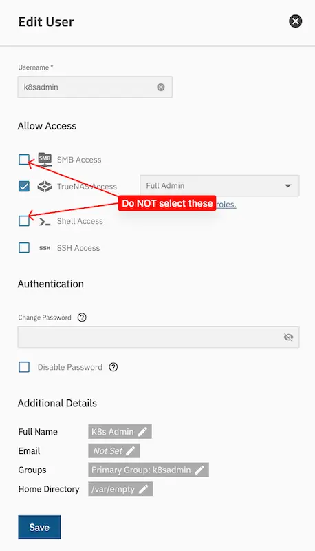 

The password as such is not relevant, as we'll be using an API token for authentication. Next, go to **Credentials** > **Groups** and select the automatically created group `k8sadmin`. Edit the group and add the permissions by adding the privileges `Local Administrator`. Unfortunately its not possible to define custom roles.

Next, go back to **Credentials** > **Users**, click on user `k8sadmin` to select it. In the **Access** card of user `k8sadmin`, click Api Keys. Create a new API key, which should never expire. Give it a name like `Kubernetes CSI` and select the user `k8sadmin`. Copy the generated key, we'll need it later.

#### NFS User

We also need a user that will own the NFS datasets. Create another user with the following settings:

- Full Name: `K8s NFS`
- Username: `nfs`
- Disable Password
- Additional Details -> Groups -> Primary Group: `nfs`
- Disable: `SMB Access` and `Shell Access`

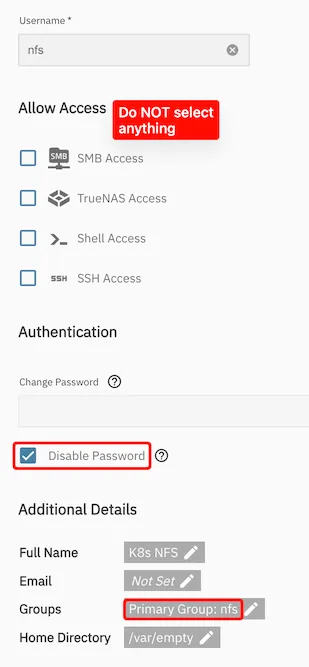 

---

## NFS Setup

Now lets start with the NFS configuration. First, we need to prepare a couple of things on TrueNAS.

### TrueNAS Configuration

- Go to **System**, **Services** and click the **pencil** icon next to NFS
- If you have a dedicated NFS network, select it under `Bind IP Addresses`
- Enable **NFSv3** (it may be possible to make NFSv4 work, too, but I haven't tried it)
- **Enable** the service and configure it to start on boot

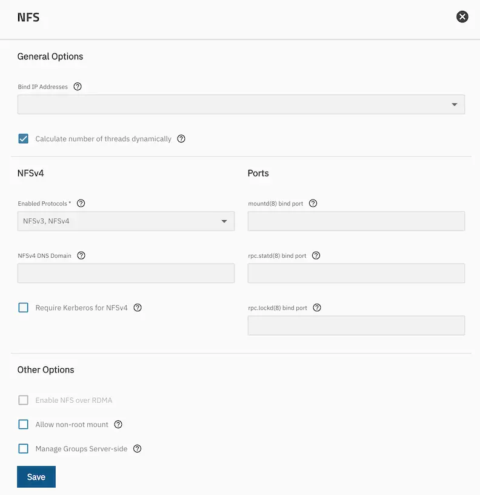 

Next, we need to create a dataset that will be used. In contrast to many other guides, these **datasetets do not need to be shared via NFS**, instead Democratic CSI will create child datasets for each PVC and automatically configure the sharing settings. You'll need two datasets, one for the actual volumes and one for the snapshots.

Go to Datasets and create a structure to your liking, just make sure you end up with **two datasets, which may NOT be children of each other** (but can be siblings). Using the default dataset presets is fine. This should look somewhat like this:

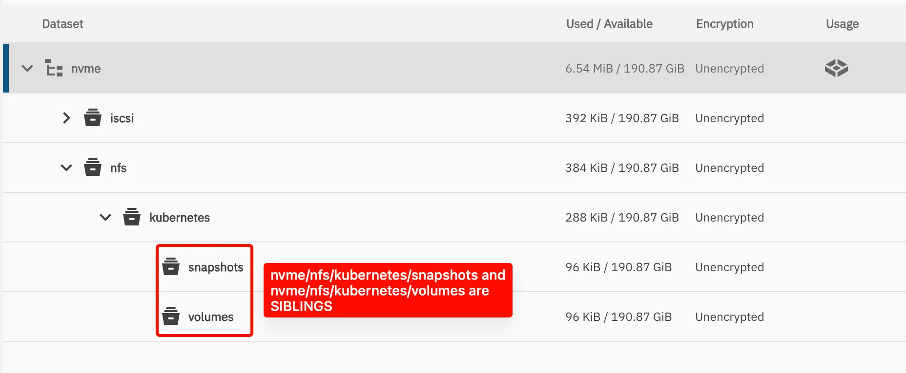 

Next we change the permissions of both datasets to be owned by the `nfs` user we created earlier. Click on the parent dataset (if you have one, otherwise repeat the steps for both datasets) and and select Edit in the permissions widget. Change the owner user and group to `nfs`, confirm both changes and apply the changes recursively.

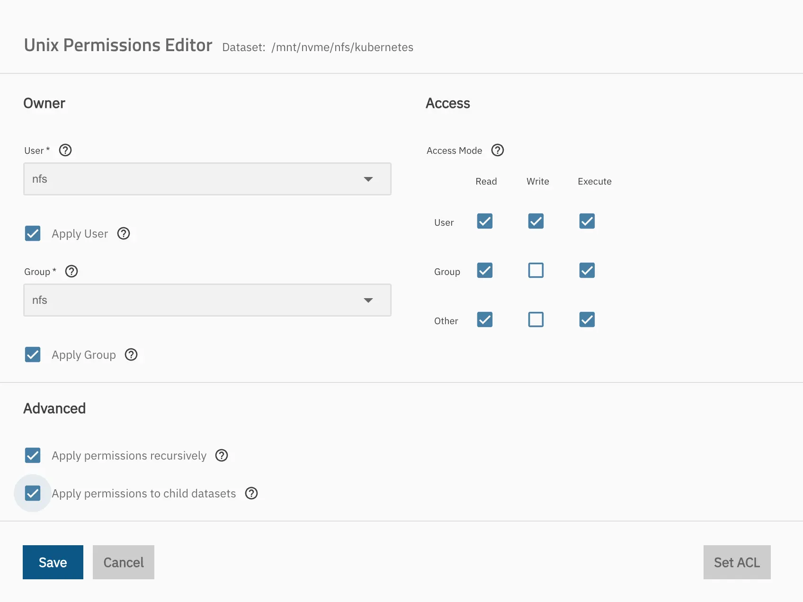 

### Democratic CSI Deployment

The next step is to deploy Democratic CSI to the cluster. The project provides a Helm chart which we are going to use, however finding the correct values was a bit challenging. In general, we need to provide the **driver** and its details and the `storageClasses` and `volumeSnapshotClasses` it should create. The driver details contain the TrueNAS connection details, including the API user, therefore I decided to use a Kubernetes secret for that.

`truenas-nfs-driver-config.yaml`

```yaml
---
apiVersion: v1
kind: Secret
metadata:
  name: truenas-nfs-driver-config
  namespace: storage
stringData:
  driver-config-file.yaml: |
    driver: freenas-api-nfs
    httpConnection:
      allowInsecure: true
      apiKey: $TRUENAS_API_KEY
      host: 192.168.0.9
      port: 80
      protocol: http
    instance_id: null
    nfs:
      shareCommentTemplate: "{{ parameters.[csi.storage.k8s.io/pvc/namespace] }}-{{ parameters.[csi.storage.k8s.io/pvc/name] }}"
      shareAlldirs: false
      shareAllowedNetworks:
      - 10.0.0.0/13
      shareHost: 192.168.0.9
      shareMapallGroup: nfs
      shareMapallUser: nfs
    zfs:
      datasetEnableQuotas: true
      datasetEnableReservation: false
      datasetParentName: nvme/nfs/kubernetes/volumes
      datasetPermissionsGroup: 3001
      datasetPermissionsMode: "0777"
      datasetPermissionsUser: 3003
      detachedSnapshotsDatasetParentName: nvme/nfs/kubernetes/snapshots
      datasetProperties:
        "org.freenas:description": "{{ parameters.[csi.storage.k8s.io/pvc/namespace] }}/{{ parameters.[csi.storage.k8s.io/pvc/name] }}"
```

A few notes:

- Setting a `shareCommentTemplate`is very useful to identify shares. Those will be displayed if you inspect NFS shares
- Similarly, setting the `org.freenas:description` property on datasets shows the comment on the dataset itself
- The `shareAllowedNetworks` should contain the network(s) your Kubernetes nodes are in
- The `shareHost` should be the IP address of your TrueNAS appliance in the network
- The `datasetParentName` and `detachedSnapshotsDatasetParentName` should be the full path to the datasets you created earlier
- The `datasetPermissionsUser` and `datasetPermissionsGroup` should be the UID and GID of the `nfs` user you created earlier.

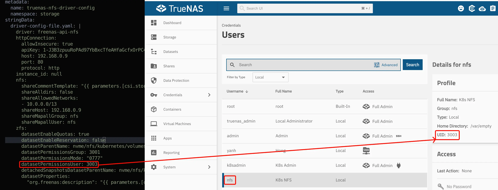 

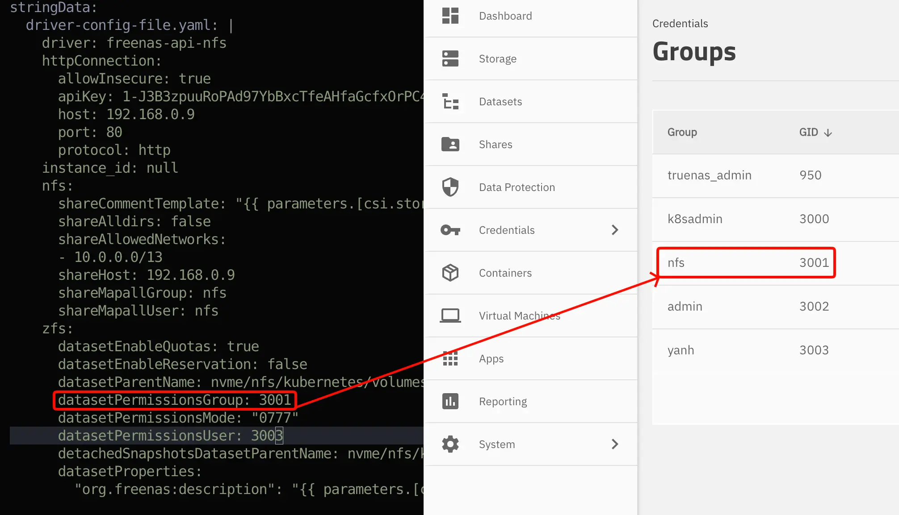 

Create the namespace and the secret:

```
kubectl create namespace storage
kubectl apply -f truenas-nfs-driver-config.yaml

# If using Talos, we also need to allow privileged containers in the storage namespace
kubectl label namespace storage pod-security.kubernetes.io/enforce=privileged
```

With this secret created, we can now create a `nfs_democratic_csi_helm.yaml` file for the Helm chart:

```yaml
controller:
  driver:
    image:
      tag: next
csiDriver:
  name: nfs
driver:
  config:
    driver: freenas-api-nfs
  existingConfigSecret: truenas-nfs-driver-config
storageClasses:
  - allowVolumeExpansion: true
    defaultClass: false
    mountOptions:
      - noatime
      - nfsvers=3
      - nolock
    name: nfs
    parameters:
      detachedVolumesFromSnapshots: "false"
      fsType: nfs
    reclaimPolicy: Delete
    volumeBindingMode: Immediate
volumeSnapshotClasses:
  - name: nfs
    parameters:
      detachedSnapshots: "true"
```

Again a few notes:

- We're using the `next` tag of the image as it contains an important fix to make it work with TrueNAS 24.05. See this [Github Issue](https://github.com/democratic-csi/democratic-csi/issues/509#issuecomment-3170438096) for details.
- The `storageClasses` defines the name of the storage class, change it to your liking
- The `driver` section refers to the secret we created earlier. It still has to specify the driver type

We can then install the Helm chart:

```
helm repo add democratic-csi https://democratic-csi.github.io/charts/
helm repo update

helm upgrade --install \
  --namespace storage \
  --values nfs_democratic_csi_helm.yaml \
  nfs \
  democratic-csi/democratic-csi
```

You should now see the storage class and the driver running:

```
kubectl get sc
NAME      PROVISIONER      RECLAIMPOLICY   VOLUMEBINDINGMODE   ALLOWVOLUMEEXPANSION   AGE
nfs       nfs              Delete          Immediate           true                   5m

kubectl get pods -n storage
NAME                                             READY   STATUS    RESTARTS      AGE
nfs-democratic-csi-controller-86b8b778f7-p6j5m   6/6     Running   4 (64m ago)   5m
nfs-democratic-csi-node-6nlxw                    4/4     Running   0             5m
nfs-democratic-csi-node-fnd9p                    4/4     Running   0             5m
nfs-democratic-csi-node-tpd6s                    4/4     Running   0             5m
```

We can now test the setup by creating a PVC and mounting it to a pod. Create `test-pvc-pod.yaml`:

```yaml
---
apiVersion: v1
kind: Namespace
metadata:
  name: test
---
apiVersion: v1
kind: PersistentVolumeClaim
metadata:
  name: test-pvc
  namespace: test
spec:
  accessModes:
    - ReadWriteMany
  storageClassName: nfs
  resources:
    requests:
      storage: 10Gi
---
apiVersion: v1
kind: Pod
metadata:
  name: storage-test-pod
  namespace: test
  labels:
    app: storage-test
spec:
  containers:
  - name: test-container
    image: busybox:1.36
    command:
    - sleep
    - "3600"
    volumeMounts:
    - name: test-volume
      mountPath: /data
  volumes:
  - name: test-volume
    persistentVolumeClaim:
      claimName: test-pvc
  restartPolicy: Never
```

Apply the manifest and check that the pod is running:

```
kubectl apply -f test-pvc-pod.yaml
kubectl get pods -n test

# You can also exec into the pod and create a test file
$ kubectl exec -it storage-test-pod -n test -- sh
/ # echo "Hello World" > /data/hello.txt
/ # exit
```

Check PV and PVC

```
kubectl get pv,pvc -n test
```

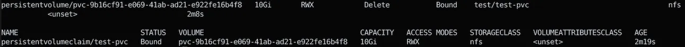 

You should now see a new share on TrueNAS and a new dataset created, which is automatically shared via NFS.

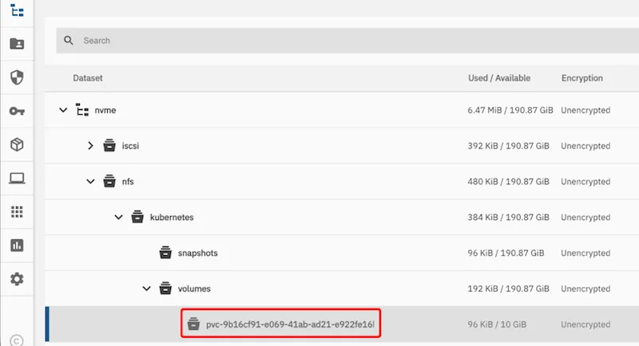 

Cleanup:

```
kubectl delete -f test-pvc-pod.yaml
```


## iSCSI Setup

iSCSI setup is relatively similar, we just have to prepare a few things on the TrueNAS side. Many guides use the iSCSI wizard, which creates a lot of things we don't need. We'll go for the minimalistic setup and only create the neccessary components.

Go to **System**, **Services** and **enable** the iSCSI service. Configure it to start on boot. You typically don't need to change any settings, but if you want to use a different port instead of the default 3260, you can change it here.

Go to **Shares** and click on the small icon right between the text `Block (iSCSI) Shares Targets` and the `RUNNING` badge:

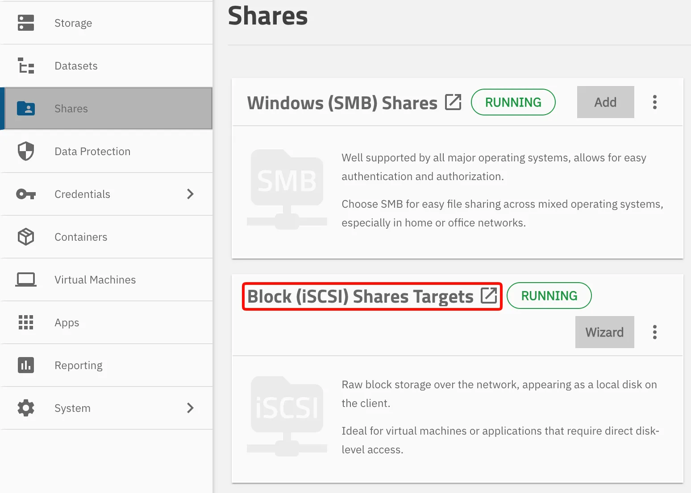 

It is not required to configure any targets or extents, this will be handled by the CSI driver via the API. However, an **Initiator Group** (essentially an ACL) is required, a **portal** needs to be configured. For the iniator group we would need to know the IQN of our Talos nodes, which I was unable to find before the first connection attempt. Therefore I created a very permissive initiator group that allows all initiators:

- Go to the **Initiator** tab, click on **Add** on **Initiator Groups** card title to add a new group
- Select `Allow all initiators`
- Optionally add a description
- Save

Note down the **Initiator Group ID**, we'll need it later.

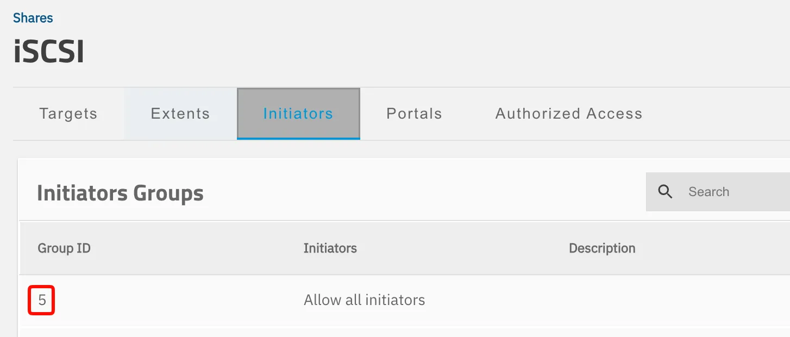 

Next, lets add a portal (essentially on which interface the iSCSI service will listen):

- Go to the **Portals** tab and **Add** a new portal:
- Select the interface you want the iSCSI service to listen on
- Optionally add a description
- Save

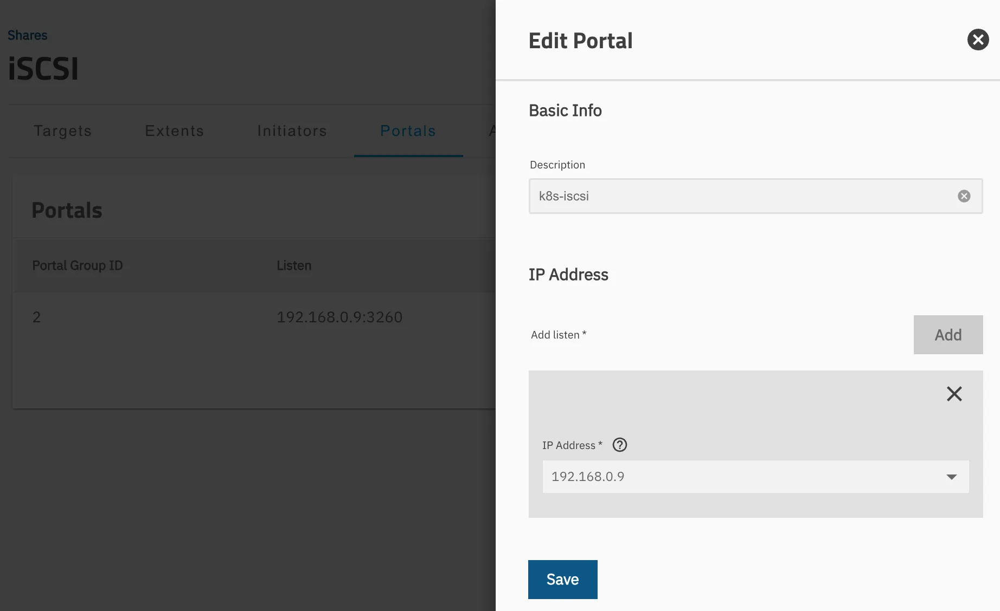 

Note down the portal ID, we'll need it later. Apparently there's some bug in the TrueNAS UI not always showing the **correct ID** (although I haven't seen it), so in doubt double check the ID by using the TrueNAS CLI. Go to **System Settings** > **Shell** from the left-hand menu. Once the dark terminal screen opens and shows the standard Linux/FreeBSD root prompt, type `cli` and press `Enter`. In TrueNAS CLI, type `sharing iscsi portal query` to see the port ID:

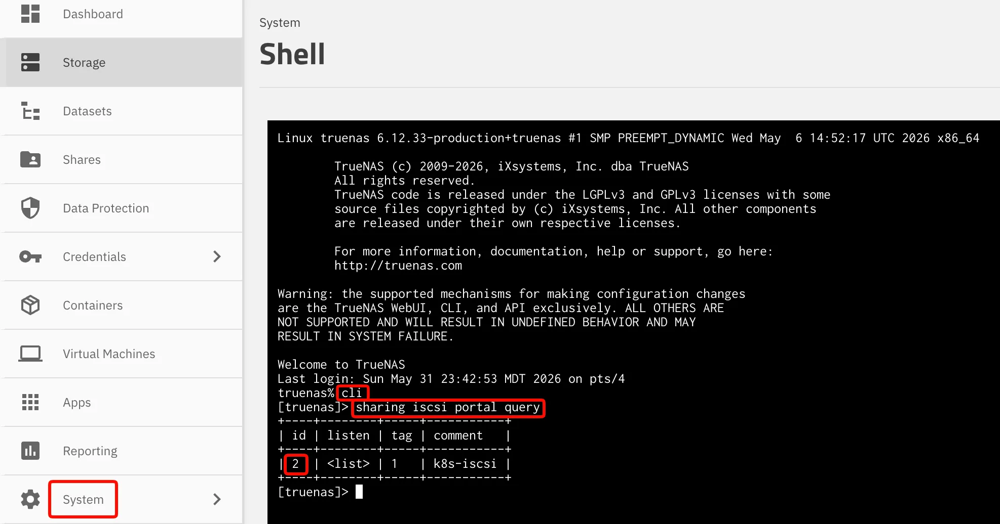 

Or in the System Shell, type `midclt call iscsi.portal.query | jq`

```
midclt call iscsi.portal.query | jq
[
  {
    "id": 2,
    "listen": [
      {
        "ip": "192.168.0.9",
        "port": 3260
      }
    ],
    "tag": 1,
    "comment": "k8s-iscsi"
  }
]
```

### Datasets

We also need to create two datasets, one for the actual volumes and one for the snapshots. Create them similar to the NFS datasets, just make sure they are not children of each other. No special settings are required. Just make sure to note the dataset paths, we'll need them later. It should look somewhat like this:

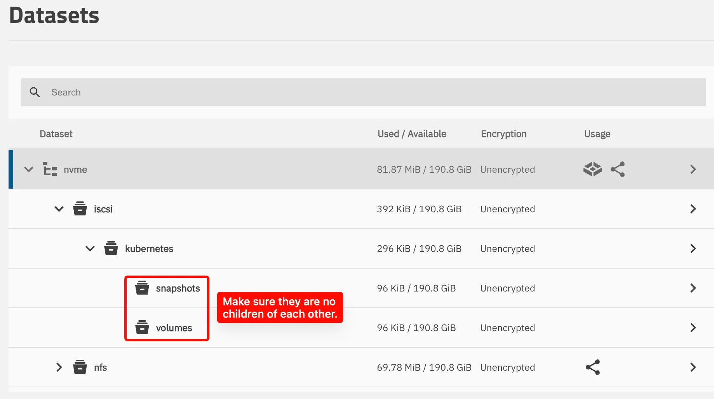 

### Democratic CSI Deployment

The iSCSI deployment is very similar to the NFS one. We again create a secret containing the driver configuration `truenas-iscsi-driver-config.yaml`:

```yaml
---
apiVersion: v1
kind: Secret
metadata:
  name: truenas-iscsi-driver-config
  namespace: storage
stringData:
  driver-config-file.yaml: |
    driver: freenas-api-iscsi
    httpConnection:
      allowInsecure: true
      apiKey: $TRUENAS_API_KEY
      host: 192.168.0.9
      port: 80
      protocol: http
    instance_id: null
    iscsi:
      targetPortal: "192.168.0.9:3260"
      targetPortals: [] 
      interface:
      namePrefix: csi-
      nameSuffix: "-cluster"
      targetGroups:
        - targetGroupPortalGroup: 2
          targetGroupInitiatorGroup: 5
          targetGroupAuthType: None
          targetGroupAuthGroup:
      extentCommentTemplate: "{{ parameters.[csi.storage.k8s.io/pvc/namespace] }}/{{ parameters.[csi.storage.k8s.io/pvc/name] }}"
      extentInsecureTpc: true
      extentXenCompat: false
      extentRpm: "SSD"
      extentBlocksize: 512
      extentAvailThreshold: 0
    zfs:
      datasetParentName: nvme/iscsi/kubernetes/volumes
      detachedSnapshotsDatasetParentName: nvme/iscsi/kubernetes/snapshots
      zvolCompression:
      zvolDedup:
      zvolEnableReservation: false
      zvolBlocksize:
      datasetProperties:
        "org.freenas:description": "{{ parameters.[csi.storage.k8s.io/pvc/namespace] }}/{{ parameters.[csi.storage.k8s.io/pvc/name] }}"
```

Again some important notes:

- The `targetPortal` should be the IP address of your TrueNAS appliance in the iSCSI network
- The `targetGroupPortalGroup` should be the ID of the portal you created earlier
- The `targetGroupInitiatorGroup` should be the ID of the initiator group you created earlier
- The `datasetParentName` and `detachedSnapshotsDatasetParentName` should be the full path to the datasets you created earlier
- The `extentCommentTemplate` is very useful to identify extents, as those will be displayed in the extent list
- You can also set properties for the ZFS volumes, I left most of them empty

Create the namespace and the secret:

```text
kubectl create namespace storage
kubectl apply -f truenas-iscsi-driver-config.yaml

# If using Talos, we also need to allow privileged containers in the storage namespace
kubectl label namespace storage pod-security.kubernetes.io/enforce=privileged
```

Verify the created secret:

```text
kubectl get secrets -n storage

NAME                          TYPE                 DATA   AGE
sh.helm.release.v1.nfs.v1     helm.sh/release.v1   1      18h
truenas-iscsi-driver-config   Opaque               1      14s
truenas-nfs-driver-config     Opaque               1      18h
```

With this secret created, we can now create a `iscsi_democratic_csi_helm.yml` file for the Helm chart:

Again a few notes:

- The `extraEnv` settings as well as `iscsiDirHostPath` and `iscsiDirHostPathType` are required for Talos only, they not be required for other Kubernetes distributions
- Depending on the Talos iSCSI extension version, the `iscsiDirHostPath` is different:
  - For version `v0.2.0` (current as of Talos 1.13.3) it is `/var/iscsi`
  - For previous versions it is `/usr/local/etc/iscsi`
- You can of course choose a different file system type if desired

We can then install the Helm chart:

```shell
helm repo add democratic-csi https://democratic-csi.github.io/charts/
helm repo update
helm upgrade --install --namespace storage --values iscsi_democratic_csi_helm.yml iscsi democratic-csi/democratic-csi
```

You should now see the storage class and the driver running:

```text
kubectl get sc
NAME      PROVISIONER      RECLAIMPOLICY   VOLUMEBINDINGMODE   ALLOWVOLUMEEXPANSION   AGE
iscsi     iscsi            Delete          Immediate           true                   26s
nfs       nfs              Delete          Immediate           true                   18h

kubectl get pods -n storage
NAME                                               READY   STATUS    RESTARTS      AGE
iscsi-democratic-csi-controller-7b598cd4f4-gmb8l   6/6     Running   0             35s
iscsi-democratic-csi-node-6ltz7                    4/4     Running   0             35s
iscsi-democratic-csi-node-jvxzc                    4/4     Running   0             35s
iscsi-democratic-csi-node-k2swk                    4/4     Running   0             35s
nfs-democratic-csi-controller-86b8b778f7-p6j5m     6/6     Running   6 (15h ago)   18h
nfs-democratic-csi-node-6nlxw                      4/4     Running   0             18h
nfs-democratic-csi-node-fnd9p                      4/4     Running   0             18h
nfs-democratic-csi-node-tpd6s                      4/4     Running   0             18h
```

Lets now test the setup by creating a PVC and mounting it to a pod. Create `test-pvc-pod.yaml`:

```yaml
---
apiVersion: v1
kind: Namespace
metadata:
  name: test
---
apiVersion: v1
kind: PersistentVolumeClaim
metadata:
  name: test-pvc
  namespace: test
spec:
  accessModes:
    - ReadWriteOnce
  storageClassName: iscsi
  resources:
    requests:
      storage: 10Gi
---
apiVersion: v1
kind: Pod
metadata:
  name: storage-test-pod
  namespace: test
  labels:
    app: storage-test
spec:
  containers:
  - name: test-container
    image: busybox:1.36
    command:
    - sleep
    - "3600"
    volumeMounts:
    - name: test-volume
      mountPath: /data
  volumes:
  - name: test-volume
    persistentVolumeClaim:
      claimName: test-pvc
  restartPolicy: Never
```

Apply the manifest and check that the pod is running:

```
kubectl apply -f test-pvc-pod.yaml
namespace/test created
persistentvolumeclaim/test-pvc created

kubectl get pods -n test
NAME               READY   STATUS    RESTARTS   AGE
storage-test-pod   1/1     Running   0          75s

# You can also exec into the pod and create a test file
kubectl exec -it storage-test-pod -n test -- sh
/ #
/ # echo "Hello World" > /data/hello.txt
/ # exit
```

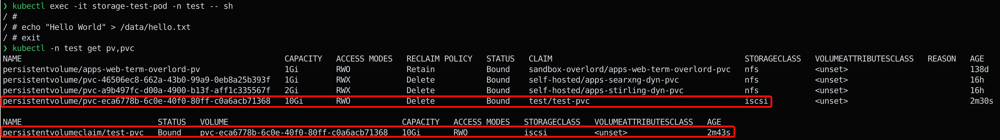 

You should now see a new share on TrueNAS and a new dataset created, which is automatically shared via iSCSI.

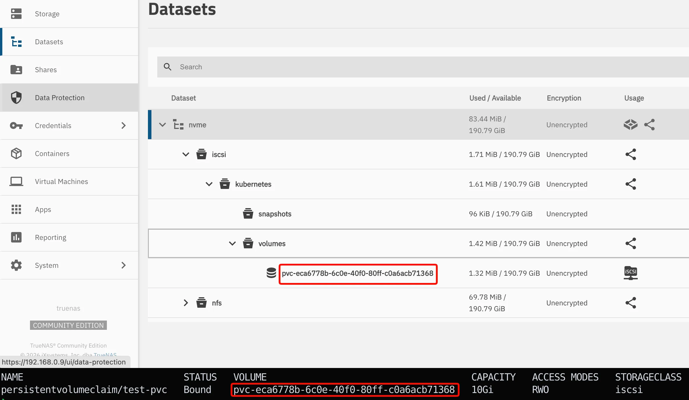 

Cleanup:

```shell
kubectl delete -f test-pvc-pod.yaml
```


## Troubleshooting

When using iSCSI and the volume is not creating with the following message:

```text
Events:
Type     Reason                  Age                  From                     Message
----     ------                  ----                 ----                     -------
Warning  FailedScheduling        2m8s                 default-scheduler        0/6 nodes are available: pod has unbound immediate PersistentVolumeClaims. not found
Warning  FailedScheduling        115s (x2 over 115s)  default-scheduler        0/6 nodes are available: pod has unbound immediate PersistentVolumeClaims. not found
Normal   Scheduled               115s                 default-scheduler        Successfully assigned storage/storage-test-pod to talos-worker1
Normal   SuccessfulAttachVolume  115s                 attachdetach-controller  AttachVolume.Attach succeeded for volume "pvc-180149f1-c13c-4a7f-9f97-db12fc2546a9"
Warning  FailedMount             20s (x7 over 100s)   kubelet                  MountVolume.MountDevice failed for volume "pvc-180149f1-c13c-4a7f-9f97-db12fc2546a9" : rpc error: code = Internal desc = {"code":1,"stdout":"","stderr":"failed to find iscsid pid for nsenter\n","timeout":false}
```

This is an indication that the iSCSI boot asset is not installed correctly. Refer to the Talos section above for details.


## Conclusion

Using Democratic CSI with TrueNAS and Talos is a solid solution to provide persistent storage for your Kubernetes cluster. The setup is relatively straightforward and provides a lot of flexibility. The driver supports both NFS and iSCSI, as well as snapshotting. The configuration can be done via the TrueNAS API, which is a big plus in my opinion. If you're looking for a way to provide storage for your Kubernetes cluster, give Democratic CSI a try!
