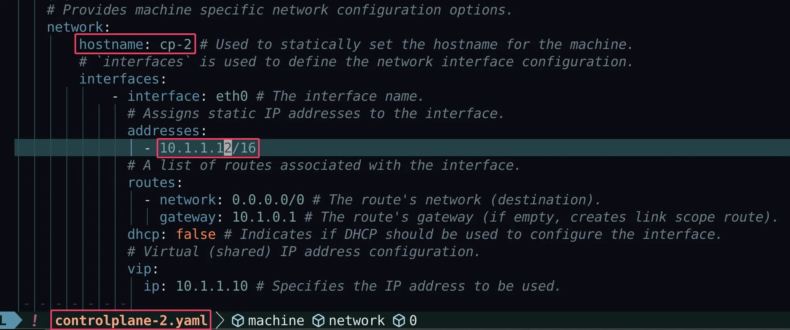
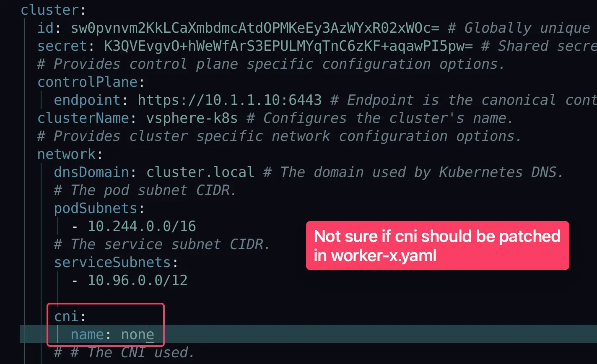
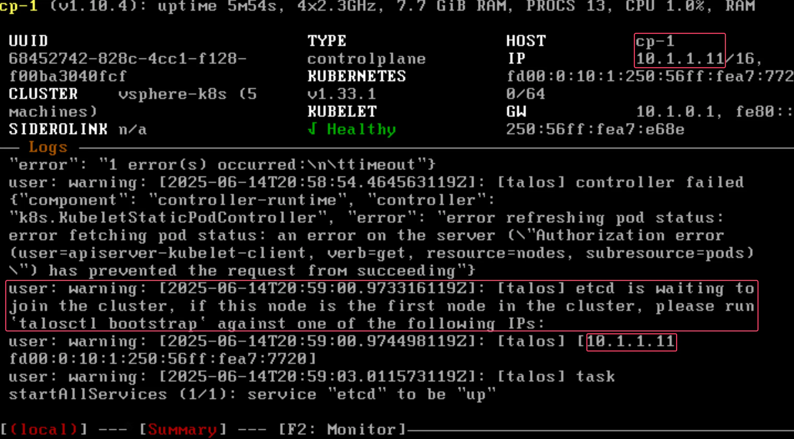
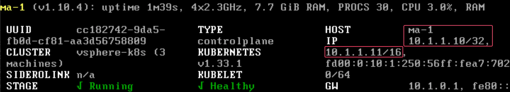

https://www.talos.dev/v1.10/introduction/getting-started/

https://www.talos.dev/v1.10/talos-guides/install/virtualized-platforms/vmware/

### Install `talosctl`

Install `talosctl` to `/usr/local/bin/talosctl`

```shell
curl -sL https://talos.dev/install | sh
```

Install `kubectl`. https://kubernetes.io/docs/tasks/tools/install-kubectl-linux/

```shell
curl -LO "https://dl.k8s.io/release/$(curl -L -s https://dl.k8s.io/release/stable.txt)/bin/linux/amd64/kubectl"

chmod +x ./kubectl
sudo mv ./kubectl /usr/local/bin
```

### Create the Machine Configuration Files

This example creates a cluster with 2 control plane nodes and 3 worker nodes. All nodes use static IP addresses.

```
cp-1      10.1.1.11
cp-2      10.1.1.12
cp-3      10.1.1.13
worker-1  10.1.1.21
worker-2  10.1.1.22
worker-3  10.1.1.23
```

Install `govc` cli to `/usr/local/bin/talosctl`. https://github.com/vmware/govmomi/tree/main/govc#installation

```shell
curl -L -o - "https://github.com/vmware/govmomi/releases/latest/download/govc_$(uname -s)_$(uname -m).tar.gz" | tar -C /usr/local/bin -xvzf - govc
```

First, download `cp.patch.yaml` to your local machine and edit the VIP to match your chosen IP. You can do this by issuing:

```shell
curl -fsSLO https://raw.githubusercontent.com/siderolabs/talos/master/website/content/v1.10/talos-guides/install/virtualized-platforms/vmware/cp.patch.yaml
```

The downloaded `cp.patch.yaml` looks like this:

```
- op: add
  path: /machine/network
  value:
    interfaces:
    - interface: eth0
      dhcp: true
      vip:
        ip: <VIP>
```

Set a static IP of control plane VM `cp-1` and custome hostname and replace `<VIP>` with IP address `10.1.1.10` in `cp.patch.yaml`. Also [deploy Cilium](https://www.talos.dev/v1.10/kubernetes-guides/network/deploying-cilium/) without `kube-proxy`.

```yaml
- op: add
  path: /machine/network
  value:
    hostname: cp-1
    interfaces:
      - interface: eth0
        dhcp: false
        addresses:
          - 10.1.1.11/16
        routes:
          - network: 0.0.0.0/0
            gateway: 10.1.0.1
        vip:
          ip: 10.1.1.10
    nameservers:
      - 1.1.1.1

- op: add
  path: /cluster/network/cni
  value:
    name: none

- op: add
  path: /cluster/proxy
  value:
    disabled: true
```

With the patch in hand, generate machine configs with:

```shell
talosctl gen config <cluster-name> <cluster-endpoint> --config-patch-control-plane @cp.patch.yaml
```

Generate config for a cluster named `vsphere-k8s`, cluster-endpoint at `<VIP>:6443`:

```
talosctl gen config vsphere-k8s https://10.1.1.10:6443 --config-patch-control-plane @cp.patch.yaml

generating PKI and tokens
Created ~/talos-vsphere/controlplane.yaml
Created ~/talos-vsphere/worker.yaml
Created ~/talos-vsphere/talosconfig
```

Create config yaml files from `controlplane.yaml` and `worker.yaml`

```
cp controlplane.yaml controlplane-1.yaml
cp controlplane.yaml controlplane-2.yaml
cp controlplane.yaml controlplane-3.yaml
cp worker.yaml worker-1.yaml
cp worker.yaml worker-2.yaml
cp worker.yaml worker-3.yaml
```

Keep `controlplane-1.yaml` as is.

Modify `controlplane-2.yaml` to reflect hostname and IP address of `cp-2`:

 

Modify `controlplane-3.yaml` to reflect hostname and IP address of `cp-3`.

Modify `worker-1.yaml`, `worker-2.yaml` and `worker-3.yaml` with worker nodes' hostnames and IPs:

```yaml
# worker-1.yaml
  network:
    hostname: worker-1
    interfaces:
      - interface: eth0
        addresses:
          - 10.1.1.21/16
        routes:
          - network: 0.0.0.0/0
            gateway: 10.1.0.1
```

```yaml
# worker-2.yaml
  network:
    hostname: worker-2
    interfaces:
      - interface: eth0
        addresses:
          - 10.1.1.22/16
        routes:
          - network: 0.0.0.0/0
            gateway: 10.1.0.1
```

```yaml
# worker-3.yaml
  network:
    hostname: worker-3
    interfaces:
      - interface: eth0
        addresses:
          - 10.1.1.23/16
        routes:
          - network: 0.0.0.0/0
            gateway: 10.1.0.1
```

Not sure if `cni` should be patched in `worker-x.yaml`

 

#### Validate the Configuration Files

```
talosctl validate --config controlplane-1.yaml --mode cloud 
controlplane-1.yaml is valid for cloud mode

talosctl validate --config controlplane-2.yaml --mode cloud 
controlplane-2.yaml is valid for cloud mode

talosctl validate --config controlplane-3.yaml --mode cloud 
controlplane-3.yaml is valid for cloud mode

talosctl validate --config worker-1.yaml --mode cloud
worker-1.yaml is valid for cloud mode

talosctl validate --config worker-2.yaml --mode cloud
worker-2.yaml is valid for cloud mode

talosctl validate --config worker-3.yaml --mode cloud
worker-3.yaml is valid for cloud mode
```

> [!IMPORTANT]
>
> Note: Using VMXNET network interfaces in VMware will cause the default [Flannel CNI](https://github.com/flannel-io/flannel) backend (vxlan) to not work between nodes. To avoid this problem it is recommended to use Intel e1000 network interfaces or apply the patch below to use the host [gateway backend](https://github.com/flannel-io/flannel/blob/master/Documentation/backends.md).

### Scripted Install

Download `vmware.sh`: https://github.com/siderolabs/talos/tree/main/website/content/v1.10/talos-guides/install/virtualized-platforms/vmware

```shell
curl -fsSL "https://raw.githubusercontent.com/siderolabs/talos/master/website/content/v1.10/talos-guides/install/virtualized-platforms/vmware/vmware.sh" | sed s/latest/v1.10.5/ > vmware.sh

chmod +x vmware.sh
```

This script has default variables for things like Talos version and cluster name that may be interesting to tweak before deploying.

#### Tweak `vmware.sh`

- Replace all occurances of `-control-plane-` with `-cp-`.
- `govc` makes use of the following environment variables. Set Environment Variables in `vmware.sh`
- Use array for `CONTROL_PLANE_MACHINE_CONFIG_PATH` and `WORKER_MACHINE_CONFIG_PATH`

```bash
export GOVC_URL=https://192.168.0.14
export GOVC_USERNAME='VCENTER_USERNAME'
export GOVC_PASSWORD='VCENTER_PASSWORD'
export GOVC_INSECURE=true
export GOVC_DATASTORE='datastore1'
export GOVC_NETWORK='LANSeg - 10.1.0.0'

CLUSTER_NAME=${CLUSTER_NAME:=k8s}
TALOS_VERSION=${TALOS_VERSION:=v1.10.5}
OVA_PATH=${OVA_PATH:="https://factory.talos.dev/image/903b2da78f99adef03cbbd4df6714563823f63218508800751560d3bc3557e40/${TALOS_VERSION}/vmware-amd64.ova"}

CONTROL_PLANE_COUNT=${CONTROL_PLANE_COUNT:=3}
CONTROL_PLANE_CPU=${CONTROL_PLANE_CPU:=4}
CONTROL_PLANE_MEM=${CONTROL_PLANE_MEM:=8192}
CONTROL_PLANE_DISK=${CONTROL_PLANE_DISK:=20G}
#~#~#~#~#~#~#~#~#~#~#~#~#~#~#~#~#~#~#~#~#~#~#~#~#~#~#~#~#~#~#~#~#~#~#~#~#~#~#~#~#~#~#~#~#~#~#~#~#~#
# CONTROL_PLANE_MACHINE_CONFIG_PATH=${CONTROL_PLANE_MACHINE_CONFIG_PATH:="./controlplane.yaml"}
# Two control plane machine configs with static IP and custom hostname
CONTROL_PLANE_MACHINE_CONFIG_PATHS=("./controlplane-1.yaml" "./controlplane-2.yaml" "./controlplane-3.yaml")

WORKER_COUNT=${WORKER_COUNT:=3}
WORKER_CPU=${WORKER_CPU:=4}
WORKER_MEM=${WORKER_MEM:=8192}
WORKER_DISK=${WORKER_DISK:=30G}
#~#~#~#~#~#~#~#~#~#~#~#~#~#~#~#~#~#~#~#~#~#~#~#~#~#~#~#~#~#~#~#~#~#~#~#~#~#~#~#~#~#~#~#~#~#~#~#~#~#
# WORKER_MACHINE_CONFIG_PATH=${WORKER_MACHINE_CONFIG_PATH:="./worker.yaml"}
# Three worker machine configs with static IP and custom hostname
WORKER_MACHINE_CONFIG_PATHS=("./worker-1.yaml" "./worker-2.yaml" "./worker-3.yaml")

...

create() {
  ## Encode machine configs
  #~#~#~#~#~#~#~#~#~#~#~#~#~#~#~#~#~#~#~#~#~#~#~#~#~#~#~#~#~#~#~#~#~#~#~#~#~#~#~#~#~#~#~#~#~#~#~#~#~#
  # CONTROL_PLANE_B64_MACHINE_CONFIG=$(cat ${CONTROL_PLANE_MACHINE_CONFIG_PATH} | base64 | tr -d '\n')
  # WORKER_B64_MACHINE_CONFIG=$(cat ${WORKER_MACHINE_CONFIG_PATH} | base64 | tr -d '\n')

  ## Create control plane nodes and edit their settings
  for i in $(seq 1 ${CONTROL_PLANE_COUNT}); do
    echo ""
    echo "launching control plane node: ${CLUSTER_NAME}-cp-${i}"
    echo ""

    #~#~#~#~#~#~#~#~#~#~#~#~#~#~#~#~#~#~#~#~#~#~#~#~#~#~#~#~#~#~#~#~#~#~#~#~#~#~#~#~#~#~#~#~#~#~#~#~#~#
    CONTROL_PLANE_B64_MACHINE_CONFIG=$(cat ${CONTROL_PLANE_MACHINE_CONFIG_PATHS[$((i - 1))]} | base64 | tr -d '\n')
    
    govc library.deploy ${CLUSTER_NAME}/talos-${TALOS_VERSION} ${CLUSTER_NAME}-cp-${i}

    govc vm.change \
      -c ${CONTROL_PLANE_CPU} \
      -m ${CONTROL_PLANE_MEM} \
      -e "guestinfo.talos.config=${CONTROL_PLANE_B64_MACHINE_CONFIG}" \
      -e "disk.enableUUID=1" \
      -vm ${CLUSTER_NAME}-cp-${i}

    govc vm.disk.change -vm ${CLUSTER_NAME}-cp-${i} -disk.name disk-1000-0 -size ${CONTROL_PLANE_DISK}

    if [ -z "${GOVC_NETWORK+x}" ]; then
      echo "GOVC_NETWORK is unset, assuming default VM Network"
    else
      echo "GOVC_NETWORK set to ${GOVC_NETWORK}"
      govc vm.network.change -vm ${CLUSTER_NAME}-cp-${i} -net "${GOVC_NETWORK}" ethernet-0
    fi

    govc vm.power -on ${CLUSTER_NAME}-cp-${i}
  done

  ## Create worker nodes and edit their settings
  for i in $(seq 1 ${WORKER_COUNT}); do
    echo ""
    echo "launching worker node: ${CLUSTER_NAME}-worker-${i}"
    echo ""

    #~#~#~#~#~#~#~#~#~#~#~#~#~#~#~#~#~#~#~#~#~#~#~#~#~#~#~#~#~#~#~#~#~#~#~#~#~#~#~#~#~#~#~#~#~#~#~#~#~#
    WORKER_B64_MACHINE_CONFIG=$(cat ${WORKER_MACHINE_CONFIG_PATHS[$((i - 1))]} | base64 | tr -d '\n')
    
    govc library.deploy ${CLUSTER_NAME}/talos-${TALOS_VERSION} ${CLUSTER_NAME}-worker-${i}
...
```

To create a content library and import the Talos OVA corresponding to the mentioned Talos version, simply issue:

```
./vmware.sh upload_ova
```

With the OVA uploaded to the **content library**, you can create a cluster with name defined in `vmware.sh` `CLUSTER_NAME=${CLUSTER_NAME:=k8s}`. If `vmware.sh create` is interrupted, run `./vmware.sh upload_ova` again.

```
./vmware.sh create

launching control plane node: k8s-cp-1

[14-06-25 14:52:31] Deploying library item...
GOVC_NETWORK set to LANSeg - 10.1.0.0
Powering on VirtualMachine:vm-22029... OK

launching control plane node: k8s-cp-2

[14-06-25 14:53:06] Deploying library item...
GOVC_NETWORK set to LANSeg - 10.1.0.0
Powering on VirtualMachine:vm-22030... OK

launching control plane node: k8s-cp-3
...

launching worker node: k8s-worker-1

[14-06-25 14:53:36] Deploying library item...
GOVC_NETWORK set to LANSeg - 10.1.0.0
Powering on VirtualMachine:vm-22031... OK

launching worker node: k8s-worker-2

[14-06-25 14:53:56] Deploying library item...
GOVC_NETWORK set to LANSeg - 10.1.0.0
Powering on VirtualMachine:vm-22032... OK

launching worker node: k8s-worker-3

[14-06-25 14:54:15] Deploying library item...
GOVC_NETWORK set to LANSeg - 10.1.0.0
Powering on VirtualMachine:vm-22033... OK
```

Create a `.env` file

```shell
export GOVC_URL=https://192.168.0.14
export GOVC_USERNAME='VCENTER_USERNAME'
export GOVC_PASSWORD='VCENTER_PASSWORD'
export GOVC_INSECURE=true
export GOVC_DATASTORE='datastore1'
export GOVC_NETWORK='LANSeg - 10.1.0.0'
```

Replace the NIC type `vmxnet3` with `e1000e` on all nodes.

```
source .env
govc device.ls -vm=k8s-cp-1

ide-200       VirtualIDEController       IDE 0
ide-201       VirtualIDEController       IDE 1
ps2-300       VirtualPS2Controller       PS2 controller 0
pci-100       VirtualPCIController       PCI controller 0
sio-400       VirtualSIOController       SIO controller 0
keyboard-600  VirtualKeyboard            Keyboard
pointing-700  VirtualPointingDevice      Pointing device; Device
video-500     VirtualMachineVideoCard    Video card
vmci-12000    VirtualMachineVMCIDevice   Device on the virtual machine PCI bus that provides support for the virtual machine communication interface
pvscsi-1000   ParaVirtualSCSIController  VMware paravirtual SCSI
disk-1000-0   VirtualDisk                20,971,520 KB
ethernet-0    VirtualVmxnet3             LANSeg - 10.1.0.0

govc device.remove -vm=k8s-cp-1 ethernet-0
govc vm.network.add -vm k8s-cp-1 -net "LANSeg - 10.1.0.0" -net.adapter e1000e
govc device.remove -vm=k8s-cp-2 ethernet-0
govc vm.network.add -vm k8s-cp-2 -net "LANSeg - 10.1.0.0" -net.adapter e1000e
govc device.remove -vm=k8s-cp-3 ethernet-0
govc vm.network.add -vm k8s-cp-3 -net "LANSeg - 10.1.0.0" -net.adapter e1000e
govc device.remove -vm=k8s-worker-1 ethernet-0
govc vm.network.add -vm k8s-worker-1 -net "LANSeg - 10.1.0.0" -net.adapter e1000e
govc device.remove -vm=k8s-worker-2 ethernet-0
govc vm.network.add -vm k8s-worker-2 -net "LANSeg - 10.1.0.0" -net.adapter e1000e 
govc device.remove -vm=k8s-worker-3 ethernet-0
govc vm.network.add -vm k8s-worker-3 -net "LANSeg - 10.1.0.0" -net.adapter e1000e 
```

Or you can delete `vmxnet3` NICs and add `e1000e` NICs to the VMs in vCenter.

#### Bootstrap Cluster

In the vSphere UI, open a console to one of the control plane nodes. You should see some output stating that `etcd` should be bootstrapped. This text should look like:

```
"etcd is waiting to join the cluster, if this node is the first node in the cluster, please run `talosctl bootstrap` against one of the following IPs:
```

 

Add `endpoints` and `nodes` to `talosconfig` file.

```yaml
# Before modification
context: vsphere-k8s
contexts:
    vsphere-k8s:
        endpoints: []
        ca: LS0tLS1C...
```

```yaml
# After modification
context: vsphere-k8s
contexts:
    vsphere-k8s:
        endpoints:
            - 10.1.0.11
        nodes:
            - 10.1.0.11
        ca: LS0tLS1C...
```

By default, `talosctl` expects a config file at `~/.talos/config` (sometimes called `talosconfig`). With  `~/.talos/config`, `--talosconfig talosconfig` can be omitted in `talosctl`.

```shell
mkdir -p ~/.talos/
cp -f talosconfig ~/.talos/config
```

Run the following command to bootstrap the cluster:

```
talosctl --talosconfig talosconfig bootstrap -e 10.1.1.11 -n 10.1.1.11
```

> [!IMPORTANT]
>
> You only need to bootstrap **ONCE**.

Once `STAGE: v Running` appears under `SIDEROLINK n/a`, you should be able to ping `<VIP>`.

> [!NOTE]
>
> `STAGE: v Running` may not appear without reboot the node.

 

#### Retrieve the `kubeconfig`

```shell
talosctl --talosconfig talosconfig config endpoint 10.1.1.11
talosctl --talosconfig talosconfig config node 10.1.1.11
talosctl --talosconfig talosconfig kubeconfig .
```

Use `kubeconfig`

```shell
mkdir -p ~/.kube
cp -f ./kubeconfig ~/.kube/config

kubectl get nodes -o wide
NAME       STATUS   ROLES           AGE   VERSION   INTERNAL-IP   EXTERNAL-IP   OS-IMAGE          KERNEL-VERSION   CONTAINER-RUNTIME
cp-1       Ready    control-plane   16d   v1.33.2   10.1.1.11     <none>        Talos (v1.10.5)   6.12.35-talos    containerd://2.0.5
cp-2       Ready    control-plane   16d   v1.33.2   10.1.1.12     <none>        Talos (v1.10.5)   6.12.35-talos    containerd://2.0.5
cp-3       Ready    control-plane   25m   v1.33.2   10.1.1.13     <none>        Talos (v1.10.5)   6.12.35-talos    containerd://2.0.5
worker-1   Ready    worker          16d   v1.33.2   10.1.1.21     <none>        Talos (v1.10.5)   6.12.35-talos    containerd://2.0.5
worker-2   Ready    worker          16d   v1.33.2   10.1.1.22     <none>        Talos (v1.10.5)   6.12.35-talos    containerd://2.0.5
worker-3   Ready    worker          16d   v1.33.2   10.1.1.23     <none>        Talos (v1.10.5)   6.12.35-talos    containerd://2.0.5
```

#### Label the Worker Nodes

```
kubectl label nodes worker-1 node-role.kubernetes.io/worker=worker
kubectl label nodes worker-2 node-role.kubernetes.io/worker=worker
kubectl label nodes worker-3 node-role.kubernetes.io/worker=worker

kubectl get nodes
NAME       STATUS   ROLES           AGE   VERSION
cp-1       Ready    control-plane   16d   v1.33.2
cp-2       Ready    control-plane   16d   v1.33.2
cp-3       Ready    control-plane   25m   v1.33.2
worker-1   Ready    worker          16d   v1.33.2
worker-2   Ready    worker          16d   v1.33.2
worker-3   Ready    worker          16d   v1.33.2
```

#### Deploying Cilium CNI - Helm manifests install

https://www.talos.dev/v1.10/kubernetes-guides/network/deploying-cilium/#method-2-helm-manifests-install

https://github.com/cilium/cilium

Add the helm repo for Cilium.

```shell
helm repo add cilium https://helm.cilium.io/
helm repo update
```

```shell
helm template \
    cilium \
    cilium/cilium \
    --version 1.17.5 \
    --namespace kube-system \
    --set ipam.mode=kubernetes \
    --set kubeProxyReplacement=true \
    --set securityContext.capabilities.ciliumAgent="{CHOWN,KILL,NET_ADMIN,NET_RAW,IPC_LOCK,SYS_ADMIN,SYS_RESOURCE,DAC_OVERRIDE,FOWNER,SETGID,SETUID}" \
    --set securityContext.capabilities.cleanCiliumState="{NET_ADMIN,SYS_ADMIN,SYS_RESOURCE}" \
    --set cgroup.autoMount.enabled=false \
    --set cgroup.hostRoot=/sys/fs/cgroup \
    --set k8sServiceHost=localhost \
    --set k8sServicePort=7445 > cilium.yaml

kubectl apply -f cilium.yaml

# Check if cilium-xxx pods are running
kubectl get pods -n kube-system
```

#### Configure `talos-vmtoolsd`

https://www.talos.dev/v1.10/talos-guides/install/virtualized-platforms/vmware/#configure-talos-vmtoolsd

#### Upgrading Talos Linux

https://www.talos.dev/v1.10/talos-guides/upgrading-talos/

To upgrade a Talos node, specify the node’s IP address and the installer container image for the version of Talos to upgrade to.

For instance, if your Talos node has the IP address `10.1.1.21` and you want to install the current version, you would enter a command such as:

```text-x-trilium-auto
talosctl upgrade --nodes 10.1.1.21 \
  --image ghcr.io/siderolabs/installer:v1.10.5
```

#### Upgrading a Talos Node by Recreating It

Update `vmware.sh` to use latest Talos Linux version.

```
TALOS_VERSION=${TALOS_VERSION:=v1.10.5}
```

```bash
# Delete old Talos Linux ova
./vmware.sh delete_ova
# Upload the latest Talos Linux ova
./vmware.sh upload_ova
```

```bash
source .env

# This example deletes k8s-cp-2 node and recreate it.
govc vm.destroy k8s-cp-2
./vmware.sh create
govc device.remove -vm=k8s-cp-2 ethernet-0
govc vm.network.add -vm k8s-cp-2 -net "LANSeg - 10.1.0.0" -net.adapter e1000e
```

#### Upgrading Kubernetes

https://www.talos.dev/v1.10/kubernetes-guides/upgrading-kubernetes/

```text-x-trilium-auto
talosctl --nodes 10.1.1.10 upgrade-k8s --to 1.33.2
```
